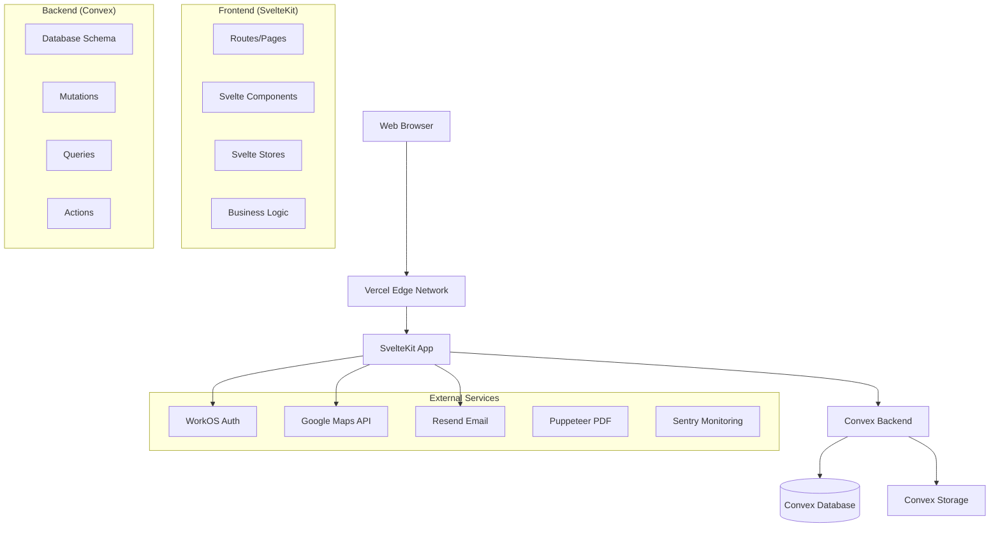
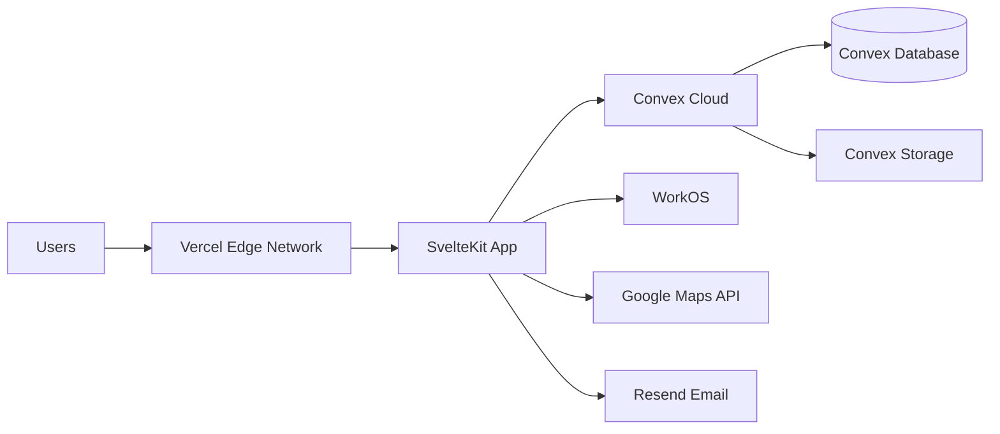

# RouteWise Design Document

**Project**: RouteWise (formerly PlannerTours)
**Version**: 2.0 - SaaS Transformation
**Date**: November 24, 2025
**Status**: Planning Phase

---

## Overview

RouteWise is a multi-tenant SaaS platform for transportation quotation, fleet management, and operations workflow. The system transforms the existing single-tenant PlannerTours application into a comprehensive business management solution for transportation service providers.

### Strategic Architecture Decision

**Technology Stack**: SvelteKit + WorkOS + Convex (Scenario 2 from Migration Plan)

**Rationale**:
- **Performance**: 40-60% smaller bundles than React
- **Cost Efficiency**: WorkOS free for 1M MAUs (vs Supabase 50K limit)
- **Developer Experience**: Less boilerplate, faster CRUD development
- **Future-Proof**: Modern architecture for 5+ year horizon
- **Timeline**: Only 1-2 weeks longer than Next.js option (14-18 weeks vs 13-16 weeks)

---

## Architecture

### High-Level Architecture



### Technology Stack

| Layer | Technology | Version | Purpose |
|-------|------------|---------|---------|
| **Frontend Framework** | SvelteKit | 2.x | UI framework with SSR/SSG |
| **Language** | TypeScript | 5.x | Type-safe development |
| **Styling** | Tailwind CSS | 4.x | Utility-first CSS |
| **UI Components** | Flowbite-svelte | Latest | Pre-built Svelte components |
| **Icons** | Flowbite Icons + Heroicons | Latest | Icon library |
| **Backend/Database** | Convex | Latest | Reactive database + serverless |
| **Authentication** | WorkOS AuthKit | Latest | Enterprise auth + multi-tenancy |
| **Hosting (Frontend)** | Vercel | - | Edge deployment |
| **Hosting (Backend)** | Convex Cloud | - | Managed backend |
| **PDF Generation** | Puppeteer | Latest | HTML-to-PDF conversion |
| **Email** | Resend | Latest | Transactional email |
| **Maps** | Google Maps JavaScript API | - | Route calculation & display |
| **Monitoring** | Sentry | Latest | Error tracking |

### Why SvelteKit Over Next.js?

**Performance Benefits**:
- 40-60% smaller JavaScript bundles
- No virtual DOM overhead (compiled to vanilla JS)
- Sub-1s page loads vs 1.5-2.5s with React
- High-90s Lighthouse scores vs low-90s

**Developer Experience**:
- Simpler reactivity (`$:` vs `useState`/`useEffect`)
- Two-way binding (`bind:value`) vs controlled components
- Less boilerplate for forms
- Built-in transitions and animations

**Cost Efficiency**:
- WorkOS free for 1M MAUs (vs Supabase 50K)
- Saves ~$25/month on auth costs
- Break-even at Month 3-4 with just 4-5 customers

**Trade-offs Accepted**:
- Team must learn Svelte (1-2 week investment)
- Smaller ecosystem (~10K packages vs React's 92K)
- Harder to hire Svelte developers in Honduras
- Cannot reuse existing React components (40-50% code reuse vs 90%+)

---

## Application Structure

### Directory Organization

```
routewise/
├── src/
│   ├── routes/                          # SvelteKit file-based routing
│   │   ├── +layout.svelte               # Root layout with auth
│   │   ├── +page.svelte                 # Dashboard
│   │   ├── auth/
│   │   │   ├── login/+page.svelte
│   │   │   ├── signup/+page.svelte
│   │   │   └── callback/+page.svelte
│   │   ├── clients/
│   │   │   ├── +page.svelte             # Client list
│   │   │   ├── new/+page.svelte         # Create client
│   │   │   └── [id]/+page.svelte        # Client detail/edit
│   │   ├── quotations/
│   │   │   ├── +page.svelte             # Quotation list
│   │   │   ├── new/+page.svelte         # Quotation wizard
│   │   │   └── [id]/+page.svelte        # Quotation detail
│   │   ├── itineraries/
│   │   │   ├── +page.svelte             # Itinerary list
│   │   │   ├── calendar/+page.svelte    # Calendar view
│   │   │   └── [id]/+page.svelte        # Itinerary detail
│   │   ├── invoices/
│   │   │   ├── +page.svelte             # Invoice list
│   │   │   └── [id]/+page.svelte        # Invoice detail
│   │   ├── drivers/
│   │   │   ├── +page.svelte             # Driver list
│   │   │   └── [id]/+page.svelte        # Driver detail
│   │   ├── vehicles/
│   │   │   ├── +page.svelte             # Vehicle list
│   │   │   └── [id]/+page.svelte        # Vehicle detail
│   │   ├── expenses/
│   │   │   ├── +page.svelte             # Expense advance list
│   │   │   └── [id]/+page.svelte        # Advance detail
│   │   └── settings/
│   │       ├── +page.svelte             # General settings
│   │       ├── parameters/+page.svelte  # System parameters
│   │       └── users/+page.svelte       # User management
│   ├── lib/
│   │   ├── components/
│   │   │   ├── layout/
│   │   │   │   ├── Navbar.svelte        # Main navigation
│   │   │   │   ├── Sidebar.svelte       # Side navigation
│   │   │   │   ├── ThemeToggle.svelte   # Dark/light mode toggle
│   │   │   │   └── Footer.svelte
│   │   │   ├── ui/                      # Base UI components
│   │   │   │   ├── Button.svelte
│   │   │   │   ├── Card.svelte
│   │   │   │   ├── Modal.svelte
│   │   │   │   └── DataTable.svelte
│   │   │   ├── forms/                   # Form components
│   │   │   │   ├── LocationInput.svelte
│   │   │   │   ├── VehicleSelector.svelte
│   │   │   │   └── ClientSelector.svelte
│   │   │   ├── maps/
│   │   │   │   └── RouteMap.svelte      # Google Maps integration
│   │   │   └── quotations/
│   │   │       ├── QuotationWizard.svelte
│   │   │       ├── CostBreakdown.svelte
│   │   │       └── PricingOptions.svelte
│   │   ├── stores/
│   │   │   ├── theme.ts                 # Theme state (dark/light)
│   │   │   ├── auth.ts                  # Auth state
│   │   │   └── tenant.ts                # Current tenant context
│   │   ├── services/                    # Business logic (ported from existing)
│   │   │   ├── costCalculation.ts
│   │   │   └── routeCalculation.ts
│   │   └── utils/                       # Utility functions (ported)
│   │       ├── unitConversion.ts
│   │       ├── formatting.ts
│   │       └── validation.ts
│   └── app.html                         # HTML template (dark mode default)
├── convex/                              # Convex backend
│   ├── schema.ts                        # Database schema
│   ├── tenants.ts                       # Tenant operations
│   ├── users.ts                         # User operations
│   ├── clients.ts                       # Client CRUD
│   ├── vehicles.ts                      # Vehicle CRUD
│   ├── drivers.ts                       # Driver CRUD
│   ├── parameters.ts                    # Parameter management
│   ├── quotations.ts                    # Quotation operations
│   ├── itineraries.ts                   # Itinerary operations
│   ├── invoices.ts                      # Invoice operations
│   └── expenses.ts                      # Expense advance operations
├── static/                              # Static assets
│   ├── favicon.png
│   └── images/
├── tests/                               # Test files
├── .env.local                           # Environment variables
├── svelte.config.js                     # SvelteKit configuration
├── vite.config.ts                       # Vite configuration
└── package.json
```

---

## Data Models

### Convex Schema Overview

Convex uses a document-based data model with TypeScript schema definitions. All tables automatically include tenant isolation through application-level filtering.

### Core Tables

#### tenants
```typescript
{
  companyName: string;
  slug: string;                    // URL-safe identifier
  plan: 'starter' | 'professional' | 'business' | 'enterprise';
  status: 'active' | 'suspended' | 'cancelled';
  logoUrl?: string;
  primaryContactEmail: string;
  primaryContactPhone?: string;
  address?: string;
  city?: string;
  country: string;                 // Default: 'Honduras'
  timezone: string;                // Default: 'America/Tegucigalpa'
  settings: object;                // JSON settings
  createdAt: number;               // Unix timestamp
  updatedAt: number;
}
```

#### users
```typescript
{
  tenantId: Id<"tenants">;
  workosUserId: string;            // WorkOS user ID
  email: string;
  fullName: string;
  avatarUrl?: string;
  role: 'admin' | 'sales' | 'operations' | 'finance' | 'viewer';
  status: 'active' | 'inactive';
  lastLoginAt?: number;
  createdAt: number;
  updatedAt: number;
}
```

#### vehicles
```typescript
{
  tenantId: Id<"tenants">;
  name: string;                    // Display name
  make: string;
  model: string;
  year: number;
  licensePlate?: string;
  passengerCapacity: number;
  fuelCapacity: number;            // Gallons
  fuelEfficiency: number;
  fuelEfficiencyUnit: 'mpg' | 'mpl' | 'kpl' | 'kpg';
  costPerDistance: number;         // HNL per km/mile
  costPerDay: number;              // HNL per day
  distanceUnit: 'km' | 'mile';
  ownership: 'owned' | 'rented';
  status: 'active' | 'maintenance' | 'inactive';
  createdAt: number;
  updatedAt: number;
}
```

#### clients
```typescript
{
  tenantId: Id<"tenants">;
  type: 'individual' | 'company';
  companyName?: string;
  firstName?: string;
  lastName?: string;
  email?: string;
  phone?: string;
  address?: string;
  city?: string;
  country: string;
  taxId?: string;                  // RTN for invoicing
  pricingLevel: 'standard' | 'preferred' | 'vip';
  discountPercentage: number;      // 0-100
  creditLimit: number;             // HNL
  paymentTerms: number;            // Days
  notes?: string;
  status: 'active' | 'inactive';
  createdBy?: Id<"users">;
  createdAt: number;
  updatedAt: number;
}
```

#### quotations
```typescript
{
  tenantId: Id<"tenants">;
  quotationNumber: string;         // COT-YYYY-####
  clientId?: Id<"clients">;
  vehicleId?: Id<"vehicles">;
  createdBy?: Id<"users">;

  // Trip details
  origin: string;
  destination: string;
  baseLocation: string;
  groupSize: number;
  extraMileage: number;
  estimatedDays: number;

  // Route information
  totalDistance: number;           // km
  totalTime: number;               // minutes
  routeData?: any;                 // Google Maps route data

  // Cost breakdown (HNL)
  fuelCost: number;
  refuelingCost: number;
  driverMealsCost: number;
  driverLodgingCost: number;
  driverIncentiveCost: number;
  vehicleDistanceCost: number;
  vehicleDailyCost: number;
  tollCost: number;
  totalCost: number;

  // Pricing
  selectedMarkupPercentage: number;
  salePriceHnl: number;
  salePriceUsd: number;
  exchangeRateUsed: number;

  // Options
  includeFuel: boolean;
  includeMeals: boolean;
  includeTolls: boolean;
  includeDriverIncentive: boolean;

  // Status & workflow
  status: 'draft' | 'sent' | 'approved' | 'rejected' | 'expired';
  validUntil?: number;
  notes?: string;
  internalNotes?: string;

  // PDF
  pdfUrl?: string;
  pdfGeneratedAt?: number;

  // Timestamps
  sentAt?: number;
  approvedAt?: number;
  rejectedAt?: number;
  createdAt: number;
  updatedAt: number;
}
```

#### itineraries
```typescript
{
  tenantId: Id<"tenants">;
  itineraryNumber: string;         // ITI-YYYY-####
  quotationId?: Id<"quotations">;
  clientId?: Id<"clients">;
  vehicleId?: Id<"vehicles">;
  driverId?: Id<"drivers">;
  createdBy?: Id<"users">;

  // Trip details
  origin: string;
  destination: string;
  baseLocation: string;
  groupSize: number;

  // Schedule
  startDate: number;               // Unix timestamp
  endDate: number;
  estimatedDays: number;

  // Pickup/Dropoff
  pickupLocation: string;
  pickupTime: string;              // HH:MM format
  dropoffLocation: string;
  dropoffTime?: string;

  // Costs
  totalDistance: number;
  totalCost: number;
  agreedPriceHnl: number;
  agreedPriceUsd: number;

  // Status
  status: 'scheduled' | 'in_progress' | 'completed' | 'cancelled';
  routeLink?: string;              // Google Maps link

  // Timestamps
  startedAt?: number;
  completedAt?: number;
  cancelledAt?: number;
  createdAt: number;
  updatedAt: number;
}
```

#### invoices
```typescript
{
  tenantId: Id<"tenants">;
  invoiceNumber: string;           // INV-YYYY-####
  itineraryId?: Id<"itineraries">;
  clientId?: Id<"clients">;
  createdBy?: Id<"users">;

  // Invoice details
  invoiceDate: number;
  dueDate: number;
  subtotalHnl: number;
  taxPercentage: number;           // Default: 15 (ISV)
  taxAmountHnl: number;
  totalHnl: number;
  totalUsd?: number;

  // Payment tracking
  amountPaid: number;
  amountDue: number;
  paymentStatus: 'unpaid' | 'partial' | 'paid' | 'overdue';

  // Additional
  additionalCharges?: array;
  discounts?: array;

  // PDF
  pdfUrl?: string;
  pdfGeneratedAt?: number;

  // Status
  status: 'draft' | 'sent' | 'paid' | 'cancelled';
  notes?: string;

  // Timestamps
  sentAt?: number;
  paidAt?: number;
  createdAt: number;
  updatedAt: number;
}
```

---

## Component Architecture

### Layout Components

#### Navbar.svelte
- Company logo and branding
- Main navigation links
- User profile dropdown
- Theme toggle (dark/light)
- Notifications bell
- Mobile hamburger menu

#### Sidebar.svelte
- Collapsible side navigation
- Grouped menu items:
  - Dashboard
  - Sales (Quotations, Clients)
  - Operations (Itineraries, Drivers, Vehicles)
  - Finance (Invoices, Expenses)
  - Settings
- Active route highlighting
- Role-based menu filtering

#### ThemeToggle.svelte
- Sun/Moon icon toggle
- Persists preference to localStorage
- Updates document class (`dark`/`light`)
- Smooth transition animations

### Business Components

#### QuotationWizard.svelte
Multi-step form for creating quotations:
1. Client selection (with quick-create)
2. Route details (origin, destination, dates)
3. Vehicle selection (filtered by capacity)
4. Options (fuel, meals, tolls, incentive)
5. Cost review and markup selection
6. Preview and save

#### CostBreakdown.svelte
- Displays itemized costs
- Fuel costs with consumption details
- Driver expenses (meals, lodging, incentive)
- Vehicle costs (distance + daily)
- Toll costs
- Total cost summary
- Currency toggle (HNL/USD)

#### PricingOptions.svelte
- Displays 5 markup options (10%, 15%, 20%, 25%, 30%)
- Highlights recommended 15% markup
- Shows cost, markup amount, and sale price
- Displays in both HNL and USD
- Visual cards with hover effects

#### RouteMap.svelte
- Google Maps integration
- Displays route with markers
- Shows origin, destination, base location
- Distance and duration display
- Alternative routes (if available)
- Responsive map sizing

---

## Authentication & Authorization

### WorkOS Integration

**Authentication Flow**:
1. User clicks "Sign In" → Redirects to WorkOS hosted UI
2. User authenticates (email/password or OAuth)
3. WorkOS redirects to `/auth/callback` with code
4. Backend exchanges code for session
5. Session stored in secure cookie
6. User redirected to dashboard

**Multi-Tenancy**:
- WorkOS Organizations map to RouteWise Tenants
- User can belong to multiple organizations
- Active organization stored in session
- All queries automatically scoped to active tenant

**Role-Based Access Control (RBAC)**:
```typescript
const permissions = {
  admin: ['*'],  // All permissions
  sales: ['quotations.*', 'clients.*', 'reports.sales'],
  operations: ['itineraries.*', 'drivers.*', 'vehicles.*', 'expenses.*'],
  finance: ['invoices.*', 'payments.*', 'reports.financial'],
  viewer: ['*.read']
};
```

---

## Business Logic Services

### Cost Calculation Service

**Ported from existing Next.js app** with minimal changes:

```typescript
// src/lib/services/costCalculation.ts

export class CostCalculationService {
  calculateFuelCosts(distance: number, vehicle: Vehicle, fuelPrice: number): FuelCosts {
    // Port existing algorithm
  }

  calculateDriverExpenses(days: number, params: Parameters): DriverExpenses {
    // Port existing algorithm
  }

  calculateVehicleCosts(distance: number, days: number, vehicle: Vehicle): VehicleCosts {
    // Port existing algorithm
  }

  calculateTotalCosts(request: CostRequest): DetailedCosts {
    // Port existing algorithm
  }
}
```

### Route Calculation Service

**Ported from existing Next.js app** with Google Maps API integration:

```typescript
// src/lib/services/routeCalculation.ts

export class RouteCalculationService {
  async calculateRoute(origin: string, destination: string, baseLocation: string): Promise<RouteResult> {
    // Port existing Google Maps integration
  }

  async getDistanceMatrix(origins: string[], destinations: string[]): Promise<DistanceMatrix> {
    // Port existing Distance Matrix API integration
  }
}
```

---

## PDF Generation

### Puppeteer Implementation

**Approach**: HTML-to-PDF conversion using headless Chrome

```typescript
// convex/actions/generatePDF.ts

export const generateQuotationPDF = action({
  args: { quotationId: v.id("quotations") },
  handler: async (ctx, args) => {
    // 1. Fetch quotation data
    // 2. Render HTML template
    // 3. Launch Puppeteer
    // 4. Generate PDF
    // 5. Upload to Convex storage
    // 6. Return PDF URL
  }
});
```

**PDF Templates**:
- Quotation PDF: Professional quote with branding
- Invoice PDF: Formal invoice with tax breakdown
- Itinerary PDF: Trip details for driver

---

## Performance Optimization

### Bundle Size Optimization
- **SvelteKit**: Compiled components (no runtime overhead)
- **Code Splitting**: Automatic route-based splitting
- **Tree Shaking**: Unused code eliminated at build time
- **Target**: <100KB initial bundle

### Database Performance
- **Convex**: Sub-50ms query latency
- **Indexes**: Optimized for common queries
- **Real-time**: Built-in subscriptions (no polling)
- **Caching**: Automatic query result caching

### API Performance
- **Google Maps**: Aggressive route caching (99% hit rate)
- **Debouncing**: Location input debounced to 500ms
- **Lazy Loading**: Maps loaded only when needed

---

## Security Considerations

### Data Isolation
- **Tenant Scoping**: All queries filtered by tenantId
- **WorkOS Organizations**: Native multi-tenancy support
- **Row-Level Security**: Enforced at application level

### Authentication Security
- **Session Management**: Secure HTTP-only cookies
- **Token Rotation**: Automatic refresh token rotation
- **CSRF Protection**: Built-in SvelteKit CSRF tokens

### Data Protection
- **Encryption in Transit**: HTTPS/TLS 1.3
- **Encryption at Rest**: Convex automatic encryption
- **Audit Logging**: All mutations logged with user context

---

## Deployment Architecture

### Production Environment



**Hosting**:
- **Frontend**: Vercel (edge deployment, automatic HTTPS)
- **Backend**: Convex Cloud (managed, auto-scaling)
- **CDN**: Vercel Edge Network (global distribution)

**Monitoring**:
- **Errors**: Sentry error tracking
- **Performance**: Vercel Analytics
- **Uptime**: Vercel monitoring

---

## Migration Strategy

### Code Reuse from Existing App

**What Can Be Reused (30-40%)**:
- ✅ Business logic algorithms (cost calculation, route calculation)
- ✅ Utility functions (unit conversion, formatting, validation)
- ✅ Type definitions (with modifications for Convex)
- ✅ Design system (Tailwind CSS v4, dark mode theme)

**What Must Be Rebuilt (60-70%)**:
- ❌ All UI components (React → Svelte)
- ❌ Data layer (JSON/localStorage → Convex)
- ❌ Authentication (none → WorkOS)
- ❌ 50+ new CRUD screens for SaaS features
- ❌ PDF generation (new feature)
- ❌ Email integration (new feature)

### Migration Timeline

**Phase 0: Learning & Setup** (Weeks 1-2)
- Team learns Svelte, SvelteKit, Convex
- Project initialization and configuration

**Phase 1: Foundation** (Weeks 2-4)
- Database schema and authentication
- User and tenant management

**Phase 2: Data Migration** (Week 5)
- Port business logic
- Migrate vehicle and parameter data

**Phase 3-10: Feature Development** (Weeks 6-18)
- Client management
- Quotation system
- PDF generation
- Driver management
- Itinerary management
- Invoice system
- Expense advances
- Dashboard and analytics

---

## Success Metrics

### Technical Metrics
- **Performance**: >90 Lighthouse score, <3s page loads
- **Reliability**: 99.9% uptime
- **Security**: Zero critical vulnerabilities
- **Code Quality**: >80% test coverage (future)

### Business Metrics (Year 1)
- **Customers**: 33 paying customers
- **Users**: 120 total users
- **Revenue**: $84,960 ARR
- **Churn**: <1% monthly
- **Satisfaction**: >4.5 stars

---

**Document Version**: 2.0
**Last Updated**: November 24, 2025
**Next Review**: Upon completion of Phase 0
