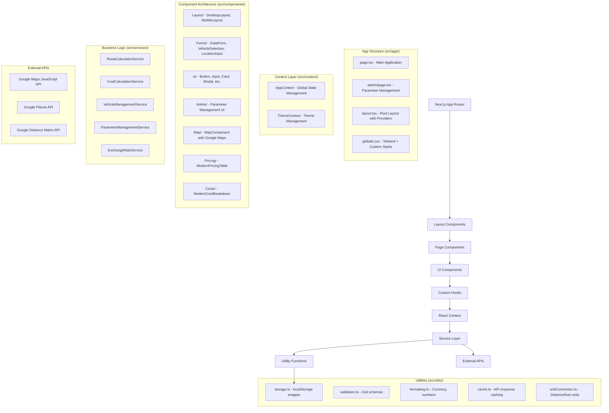

# Design Document

## Overview

The Enhanced Transportation Quotation System is a Next.js web application that provides comprehensive cost calculations, route planning, and pricing management for transportation services. The system integrates with Google Distance Matrix API and Google Maps API to calculate accurate routes, distances, and travel times while providing detailed cost breakdowns and pricing options with configurable profit margins.

The application follows a modular architecture with clear separation of concerns, utilizing React components for the UI, custom hooks for state management, and service layers for business logic and external API integrations.

## Architecture

### High-Level Architecture



### Technology Stack

- **Frontend Framework**: Next.js 15.5.6 with App Router
- **UI Library**: React 19.1.0 with TypeScript 5.x
- **Styling**: Tailwind CSS v4 with DaisyUI v5.3.7 and custom theme configuration
- **UI Components**:
  - Headless UI v2.2.9 for accessible components
  - Radix UI components (@radix-ui/react-dialog, @radix-ui/react-popover)
  - Custom UI component library in `src/components/ui/`
- **State Management**: React Context API with useReducer pattern
- **Maps Integration**: Google Maps JavaScript API with TypeScript definitions
- **HTTP Client**: Native Fetch API with custom service layer wrappers
- **Data Persistence**: localStorage with custom storage utilities
- **Form Handling**: React Hook Form v7.65.0 with Zod v4.1.12 validation
- **Design System**: Dark-first theme with glassmorphism effects and gradient accents
- **Build Tools**:
  - PostCSS with @tailwindcss/postcss v4
  - ESLint v8.57.0 with Next.js configuration
  - Autoprefixer for CSS vendor prefixes

## Components and Interfaces

### Actual Component Structure

#### 1. Layout Components (`src/components/Layout/`)
```typescript
// DesktopLayout.tsx - Main desktop interface with glassmorphism design
export default function DesktopLayout(): JSX.Element

// MobileLayout.tsx - Mobile-optimized interface
export default function MobileLayout(): JSX.Element

// MobileNavigation.tsx - Mobile navigation component
interface MobileNavigationProps {
  isOpen: boolean;
  onClose: () => void;
}
```

#### 2. Form Components (`src/components/Forms/`)
```typescript
// DataForm.tsx - Main quotation form with modern dark styling
interface DataFormProps extends Partial<QuotationFormProps> {
  onSubmit?: (data: QuotationFormData) => void;
}

// VehicleSelection.tsx - Vehicle selection with capacity filtering
interface VehicleSelectionProps {
  vehicles: any[];
  groupSize: number;
  onVehicleSelect: (vehicles: Vehicle[] | Vehicle | null) => void;
  selectedVehicle?: Vehicle | Vehicle[];
}

// LocationInput.tsx - Google Places autocomplete input
interface LocationInputProps {
  value: string;
  onChange: (value: string) => void;
  onPlaceSelect?: (place: PlaceResult) => void;
  placeholder?: string;
  enableAutocomplete?: boolean;
}

// RangeSlider.tsx - Custom range slider component
interface RangeSliderProps {
  min: number;
  max: number;
  step: number;
  value: number;
  onChange: (value: number) => void;
  unit?: string;
}
```

#### 3. UI Component Library (`src/components/ui/`)
```typescript
// Button.tsx - Modern button with variants and loading states
interface ButtonProps extends React.ButtonHTMLAttributes<HTMLButtonElement> {
  variant?: 'primary' | 'secondary' | 'outline' | 'ghost';
  size?: 'sm' | 'md' | 'lg';
  loading?: boolean;
  leftIcon?: React.ReactNode;
  rightIcon?: React.ReactNode;
}

// Input.tsx - Enhanced input with validation states
interface InputProps extends React.InputHTMLAttributes<HTMLInputElement> {
  label?: string;
  error?: string;
  helperText?: string;
  leftIcon?: React.ReactNode;
  rightIcon?: React.ReactNode;
}

// Card.tsx - Glassmorphism card component
interface CardProps extends React.HTMLAttributes<HTMLDivElement> {
  variant?: 'default' | 'outlined' | 'elevated';
  padding?: 'none' | 'sm' | 'md' | 'lg';
  hover?: boolean;
}
```

#### 4. Business Components
```typescript
// ModernPricingTable.tsx - Pricing display with markup options
interface ModernPricingTableProps {
  baseCost: number;
  exchangeRate: number;
  currency?: 'USD' | 'HNL';
}

// ModernCostBreakdown.tsx - Detailed cost analysis display
interface ModernCostBreakdownProps {
  costs: DetailedCosts;
  vehicle: Vehicle;
  currency?: 'USD' | 'HNL';
}

// MapComponent.tsx - Google Maps integration
interface MapComponentProps {
  className?: string;
}
```

#### 5. Admin Components (`src/components/Admin/`)
```typescript
// ParameterManagement.tsx - System parameter management
// ParameterCard.tsx - Individual parameter editing
// ParameterHistory.tsx - Parameter change history
// QuickParameterUpdate.tsx - Quick parameter updates
```

### Actual Service Layer (`src/services/`)

#### 1. RouteCalculatorService.ts
```typescript
class RouteCalculatorService {
  private directionsService: google.maps.DirectionsService;
  private distanceMatrixService: google.maps.DistanceMatrixService;

  calculateRoute(origin: string, destination: string, waypoints?: string[]): Promise<RouteResult>;
  calculateDistanceMatrix(origins: string[], destinations: string[]): Promise<DistanceMatrixResult>;
  private handleDirectionsResult(result: google.maps.DirectionsResult): RouteResult;
}

export const routeCalculatorService = new RouteCalculatorService();
```

#### 2. CostCalculationService.ts
```typescript
// Multiple calculator classes for different cost components
class FuelCalculator {
  calculateFuelCosts(distance: number, vehicle: Vehicle, fuelPrice: number): FuelCosts;
  calculateRefuelingCosts(distance: number, vehicle: Vehicle): RefuelingCosts;
}

class DriverExpenseCalculator {
  calculateDriverExpenses(days: number, mealCost: number, hotelCost: number): DriverExpenses;
}

class VehicleCostCalculator {
  calculateVehicleCosts(distance: number, days: number, vehicle: Vehicle): VehicleCosts;
}

class CostCalculationService {
  calculateTotalCosts(request: CostCalculationRequest): DetailedCosts;
}

export const costCalculationService = new CostCalculationService();
export const fuelCalculator = new FuelCalculator();
export const driverExpenseCalculator = new DriverExpenseCalculator();
export const vehicleCostCalculator = new VehicleCostCalculator();
```

#### 3. VehicleManagementService.ts
```typescript
class VehicleManagementService {
  private vehicles: Map<string, Vehicle> = new Map();

  loadVehicles(): Promise<void>;
  getVehicles(): Vehicle[];
  getVehiclesByCapacity(minCapacity: number): Vehicle[];
  getVehicleById(id: string): Vehicle | undefined;
  addVehicle(vehicle: Vehicle): void;
  updateVehicle(id: string, updates: Partial<Vehicle>): void;
}

export const vehicleManagementService = new VehicleManagementService();
```

#### 4. ParameterManagementService.ts
```typescript
class ParameterManagementService {
  private parameters: Map<string, Parameter> = new Map();
  private changeHistory: ParameterChange[] = [];

  loadParameters(): Promise<void>;
  getParameter(key: string): Parameter | undefined;
  updateParameter(key: string, value: number, source: string): void;
  getChangeHistory(): ParameterChange[];
  saveParametersToStorage(): void;
}

export const parameterManagementService = new ParameterManagementService();
```

#### 5. ExchangeRateService.ts
```typescript
class ExchangeRateService {
  private currentRates: ExchangeRates | null = null;
  private customRate: number | null = null;

  loadExchangeRates(): Promise<ExchangeRates>;
  getCurrentRate(): number;
  setCustomRate(rate: number): void;
  convertCurrency(amount: number, fromCurrency: string, toCurrency: string): number;
}

export const exchangeRateService = new ExchangeRateService();
```

## Data Models

### Core Data Models

#### Vehicle Model
```typescript
interface Vehicle {
  id: string;
  make: string;
  model: string;
  year: number;
  passengerCapacity: number;
  fuelCapacity: number;
  fuelEfficiency: number;
  fuelEfficiencyUnit: 'mpg' | 'mpl' | 'kpl' | 'kpg';
  costPerDistance: number;
  costPerDay: number;
  distanceUnit: 'km' | 'mile';
}
```

#### System Parameters Model
```typescript
interface SystemParameters {
  fuelPrice: number;
  mealCostPerDay: number;
  hotelCostPerNight: number;
  exchangeRate: number;
  useCustomExchangeRate: boolean;
  preferredDistanceUnit: 'km' | 'mile';
  preferredCurrency: 'USD' | 'HNL';
}
```

#### Cost Models
```typescript
interface DetailedCosts {
  fuel: FuelCosts;
  driver: DriverExpenses;
  vehicle: VehicleCosts;
  refueling: RefuelingCosts;
  total: number;
}

interface FuelCosts {
  consumption: number;
  cost: number;
  pricePerUnit: number;
}

interface DriverExpenses {
  meals: number;
  lodging: number;
  days: number;
  total: number;
}

interface VehicleCosts {
  distanceCost: number;
  dailyCost: number;
  total: number;
}

interface RefuelingCosts {
  stops: number;
  costPerStop: number;
  total: number;
}
```

#### Pricing Models
```typescript
interface PricingOption {
  markup: number;
  cost: number;
  salePrice: number;
  salePriceUSD: number;
  salePriceHNL: number;
  recommended: boolean;
}

interface QuotationResult {
  route: RouteResult;
  costs: DetailedCosts;
  vehicle: Vehicle;
  pricing: PricingOption[];
  parameters: SystemParameters;
}
```

#### Rent-a-Car Service Options (NEW FEATURE - Requirement 12)

The system now supports flexible cost component inclusion/exclusion to accommodate rent-a-car style quotations where clients may choose to handle certain costs themselves.

##### Updated Itinerary Interface
```typescript
interface Itinerary {
  vehiculos: string[];
  dias: number;
  incentivar: boolean;
  nacional: boolean;
  // NEW: Optional cost component flags for rent-a-car mode
  includeFuel?: boolean;      // Default: true (include fuel costs)
  includeMeals?: boolean;     // Default: true (include meal/lodging costs)
  includeTolls?: boolean;     // Default: true (include toll costs)
  kms: {
    extra: number;
    total: number;
  };
  // ... rest of interface
}
```

##### Updated QuotationRequest Interface
```typescript
interface QuotationRequest {
  origin: string;
  destination: string;
  baseLocation: string;
  groupSize: number;
  extraMileage?: number;
  includeDriverIncentive?: boolean;
  // NEW: Optional cost component flags
  includeFuel?: boolean;
  includeMeals?: boolean;
  includeTolls?: boolean;
}
```

##### Updated CostCalculationRequest Interface
```typescript
interface CostCalculationRequest {
  route: RouteResult;
  vehicle: Vehicle;
  groupSize: number;
  extraMileage?: number;
  includeDriverIncentive?: boolean;
  // NEW: Optional cost component flags
  includeFuel?: boolean;
  includeMeals?: boolean;
  includeTolls?: boolean;
}
```

##### Cost Calculation Logic

When optional components are excluded:
1. **Fuel Costs**: When `includeFuel = false`, ALL fuel costs (base fuel consumption + refueling expenses) are calculated internally but excluded from `costo.comun` and final totals. This represents a rent-a-car model where the client receives the vehicle with a full tank and returns it full, covering all fuel consumption themselves.
2. **Meal/Lodging Costs**: When `includeMeals = false`, driver per-diem expenses are excluded from `costo.comun` and final totals
3. **Toll Costs**: When `includeTolls = false`, toll/peaje costs are excluded from `costo.comun` and final totals

The `costo.comun` calculation becomes:
```typescript
const costoComun =
  (includeFuel ? fuelCosts : 0) +
  (includeMeals ? (meals + lodging) : 0) +
  (includeTolls ? tollCosts : 0) +
  (includeDriverIncentive ? incentive : 0) +
  borderCosts; // Border costs always included for international trips
```

##### UI Components

**Opciones Adicionales Section** (in DataForm):
```typescript
// Existing checkbox
- Incentivo para el conductor (includeDriverIncentive)

// NEW checkboxes
- Incluir Combustible (includeFuel)
- Incluir Viáticos (includeMeals)
- Incluir Peajes (includeTolls)
```

**Cost Display Behavior**:
- Excluded costs are shown in the detailed breakdown with visual indicators (strikethrough, grayed out, "(No incluido)" label)
- The "Costo [vehicle]" line in Cotización reflects only included components
- Pricing tiers (10%, 15%, 20%, 25%, 30%) calculate based only on included costs
- A summary section shows which components are included/excluded

##### Use Cases

**Full Service Mode** (Default):
- All checkboxes checked
- Traditional transportation service with all costs included
- Client pays one price for complete service

**Rent-a-Car Mode**:
- Some or all optional checkboxes unchecked
- Client handles fuel, meals, and/or tolls themselves
- When fuel is excluded: Client receives vehicle with full tank and returns it full, covering all fuel consumption
- Lower base price with client responsibility for excluded items
- Useful for long-term rentals or corporate clients with fuel cards

**Hybrid Mode**:
- Mix of included/excluded components
- Example: Include fuel and tolls, but client handles meals
- Flexible pricing for different client needs

## Error Handling

### Error Types
```typescript
enum ErrorType {
  NETWORK_ERROR = 'NETWORK_ERROR',
  API_ERROR = 'API_ERROR',
  VALIDATION_ERROR = 'VALIDATION_ERROR',
  CALCULATION_ERROR = 'CALCULATION_ERROR',
  LOCATION_NOT_FOUND = 'LOCATION_NOT_FOUND'
}

interface AppError {
  type: ErrorType;
  message: string;
  details?: any;
}
```

### Error Handling Strategy
- **Network Errors**: Retry mechanism with exponential backoff
- **API Errors**: Graceful degradation with fallback calculations
- **Validation Errors**: Real-time form validation with clear error messages
- **Calculation Errors**: Default values and user notifications
- **Location Errors**: Suggestions for alternative locations

## Testing Strategy

### Unit Testing
- **Components**: Test rendering, props handling, and user interactions
- **Services**: Test business logic, API integrations, and error scenarios
- **Utilities**: Test calculation functions and data transformations
- **Hooks**: Test state management and side effects

### Integration Testing
- **API Integration**: Test Google Maps and Distance Matrix API calls
- **End-to-End Workflows**: Test complete quotation generation process
- **Cross-Component Communication**: Test data flow between components

### Testing Tools
- **Jest**: Unit and integration testing framework
- **React Testing Library**: Component testing utilities
- **MSW (Mock Service Worker)**: API mocking for tests
- **Playwright**: End-to-end testing (optional)

## Performance Considerations

### Optimization Strategies
- **API Caching**: Cache Google API responses for repeated requests
- **Debounced Input**: Debounce location input to reduce API calls
- **Lazy Loading**: Load map components only when needed
- **Memoization**: Memoize expensive calculations
- **Code Splitting**: Split code by routes and features

### Monitoring
- **Performance Metrics**: Track API response times and calculation performance
- **Error Tracking**: Monitor and log application errors
- **User Analytics**: Track user interactions and conversion rates

## Security Considerations

### API Security
- **API Key Protection**: Secure Google API keys with domain restrictions
- **Rate Limiting**: Implement client-side rate limiting for API calls
- **Input Validation**: Validate all user inputs before processing
- **XSS Prevention**: Sanitize user inputs and use secure rendering

### Data Protection
- **Local Storage**: Encrypt sensitive data stored locally
- **Parameter Security**: Validate parameter updates and maintain audit logs
- **Session Management**: Implement secure session handling for admin features

## Modern UI Design System

### Design Principles
- **Dark-First Approach**: Default dark theme with modern aesthetics
- **Glassmorphism**: Backdrop blur effects and translucent surfaces
- **Gradient Accents**: Strategic use of gradients for visual hierarchy
- **Consistent Spacing**: 8px grid system with proper visual rhythm
- **Accessible Contrast**: WCAG AA compliant color combinations

### Actual Theme Configuration (tailwind.config.js)
```javascript
const config = {
  content: [
    './src/pages/**/*.{js,ts,jsx,tsx,mdx}',
    './src/components/**/*.{js,ts,jsx,tsx,mdx}',
    './src/app/**/*.{js,ts,jsx,tsx,mdx}',
  ],
  darkMode: 'class',
  theme: {
    extend: {
      fontFamily: {
        sans: ['IBM Plex Sans', 'ui-sans-serif', 'system-ui'],
        mono: ['IBM Plex Mono', 'ui-monospace', 'monospace'],
      },
      colors: {
        plannertours: {
          blue: '#3b82f6',
          cyan: '#06b6d4',
          dark: '#1e40af',
          accent: '#8b5cf6',
        },
        primary: {
          50: '#eff6ff', 100: '#dbeafe', 200: '#bfdbfe',
          300: '#93c5fd', 400: '#60a5fa', 500: '#3b82f6',
          600: '#2563eb', 700: '#1d4ed8', 800: '#1e40af',
          900: '#1e3a8a', 950: '#172554',
        },
        gray: {
          50: '#f9fafb', 100: '#f3f4f6', 200: '#e5e7eb',
          300: '#d1d5db', 400: '#9ca3af', 500: '#6b7280',
          600: '#4b5563', 700: '#374151', 800: '#1f2937',
          900: '#111827', 950: '#030712',
        },
      },
      animation: {
        'fade-in': 'fadeIn 0.5s ease-in-out',
        'slide-up': 'slideUp 0.3s ease-out',
        'slide-down': 'slideDown 0.3s ease-out',
        'scale-in': 'scaleIn 0.2s ease-out',
      },
    },
  },
  plugins: [require('daisyui')],
  daisyui: {
    themes: [
      {
        corporate: {
          "primary": "#3b82f6", "secondary": "#06b6d4", "accent": "#8b5cf6",
          "neutral": "#374151", "base-100": "#ffffff", "base-200": "#f3f4f6",
          "base-300": "#e5e7eb", "info": "#06b6d4", "success": "#10b981",
          "warning": "#f59e0b", "error": "#ef4444",
        },
        business: {
          "primary": "#3b82f6", "secondary": "#06b6d4", "accent": "#8b5cf6",
          "neutral": "#1f2937", "base-100": "#1f2937", "base-200": "#111827",
          "base-300": "#0f172a", "info": "#06b6d4", "success": "#10b981",
          "warning": "#f59e0b", "error": "#ef4444",
        }
      }
    ],
    darkTheme: "business", // Default to dark theme
    base: true, styled: true, utils: true,
  },
}
```

### Component Design Patterns
- **Card Components**: Glassmorphism with `bg-slate-800/50 backdrop-blur-xl`
- **Form Inputs**: Dark backgrounds with subtle borders and focus states
- **Buttons**: Gradient backgrounds with hover animations
- **Status Indicators**: Color-coded badges with proper semantic meaning
- **Loading States**: Smooth animations with skeleton placeholders

### Visual Hierarchy
1. **Primary Actions**: Gradient buttons with prominent placement
2. **Secondary Actions**: Subtle styling with clear affordances
3. **Information Display**: Card-based layout with proper grouping
4. **Navigation**: Clean header with glassmorphism effects
5. **Status Feedback**: Color-coded indicators and animations

## Deployment and Infrastructure

### Development Environment
- **Local Development**: Next.js 15.5.6 development server with hot reloading
- **Environment Variables**: Secure management of API keys and configuration
- **Development Tools**: ESLint v9, TypeScript v5 for code quality
- **Package Management**: npm with exact version matching for consistency

### Production Deployment
- **Static Generation**: Pre-generate static pages where possible
- **CDN Integration**: Serve static assets through CDN
- **Environment Configuration**: Separate configurations for different environments
- **Monitoring**: Application performance and error monitoring
- **Build Optimization**: Tailwind CSS v4 with optimized bundle sizes

### Current Implementation Status

#### ✅ Completed Architecture Components
- **App Structure**: Next.js 15.5.6 App Router with proper page organization
- **State Management**: React Context with useReducer for global state (AppContext, ThemeContext)
- **Service Layer**: Complete business logic services for all core functionality
- **Component Library**: 50+ components organized by feature and reusability
- **UI System**: Modern dark-first design with Tailwind CSS v4 and DaisyUI v5.3.7
- **Form System**: React Hook Form with Zod validation and custom components
- **Google APIs**: Maps, Places, and Distance Matrix integration
- **Data Layer**: localStorage persistence with custom utilities
- **Theme System**: Dark/light mode switching with glassmorphism effects

#### 📁 Directory Structure (Implemented)
```
src/
├── app/                    # Next.js App Router pages
│   ├── admin/             # Parameter management interface
│   ├── layout.tsx         # Root layout with providers
│   ├── page.tsx           # Main application page
│   └── globals.css        # Global styles with Tailwind
├── components/            # React components organized by feature
│   ├── Admin/            # Parameter management components
│   ├── Common/           # Shared utility components
│   ├── Costs/            # Cost display components
│   ├── Forms/            # Form and input components
│   ├── Layout/           # Layout and navigation components
│   ├── Map/              # Google Maps integration
│   ├── Pricing/          # Pricing display components
│   ├── Quotation/        # Quotation workflow (in progress)
│   ├── ui/               # Reusable UI component library
│   └── Vehicle/          # Vehicle management components
├── context/              # React Context providers
├── hooks/                # Custom React hooks
├── lib/                  # Core business logic libraries
├── services/             # External API and business services
├── types/                # TypeScript type definitions
└── utils/                # Utility functions and helpers
```

#### 🔄 In Progress
- **Quotation Workflow Integration**: useQuotationWorkflow hook and QuotationResults component
- **Export Functionality**: PDF generation and print styling
- **Advanced Features**: Quotation history, templates, and comparison tools

This design provides a solid foundation for implementing the enhanced transportation quotation system while maintaining scalability, maintainability, and exceptional user experience with modern UI patterns.