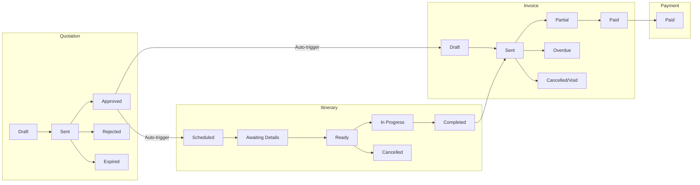

# Sales Process Workflow - RouteWise

## Executive Summary

This document defines the complete sales workflow for RouteWise transportation quotation platform: **Quotation → Itinerary → Invoice → Payment**, including automated notifications, client self-service portal, and driver documentation with QR-enabled navigation.

---

## 1. Workflow Overview

```
┌─────────────────────────────────────────────────────────────────────────────┐
│                        SALES PROCESS WORKFLOW                                │
├─────────────────────────────────────────────────────────────────────────────┤
│                                                                              │
│  QUOTATION          ITINERARY           INVOICE            PAYMENT          │
│  ─────────          ─────────           ───────            ───────          │
│                                                                              │
│  ┌─────────┐       ┌───────────┐       ┌─────────┐       ┌─────────┐       │
│  │  Draft   │       │ Scheduled │       │  Draft  │       │         │       │
│  └────┬────┘       └─────┬─────┘       └────┬────┘       │         │       │
│       │                  │                  │            │         │       │
│       ▼                  ▼                  ▼            │         │       │
│  ┌─────────┐       ┌───────────┐       ┌─────────┐       │         │       │
│  │   Sent   │       │  Awaiting │       │  Sent   │       │         │       │
│  └────┬────┘       │  Details  │       └────┬────┘       │         │       │
│       │            └─────┬─────┘            │            │         │       │
│       ▼                  │                  ▼            │         │       │
│  ┌─────────┐             ▼            ┌─────────┐       │  Paid   │       │
│  │Approved │───────▶┌─────────┐       │ Partial │──────▶│         │       │
│  └─────────┘        │  Ready  │       └─────────┘       │         │       │
│       │             └────┬────┘                         └─────────┘       │
│       │                  │                                                  │
│       ▼                  ▼                                                  │
│  Creates ──────────▶┌───────────┐                                          │
│  Itinerary          │In Progress│                                          │
│       +             └─────┬─────┘                                          │
│  Creates ────────────────▶▼                                                │
│  Invoice           ┌───────────┐                                           │
│  (prepayment)      │ Completed │                                           │
│                    └───────────┘                                           │
│                                                                              │
└─────────────────────────────────────────────────────────────────────────────┘
```



---

## 2. User Stories by Role

### 2.1 Staff Person (Sales/Operations)

#### Creating a Quotation

1. Staff creates new quotation with trip details (origin, destination, dates, group size)
2. System calculates costs (fuel, tolls, driver expenses, vehicle costs)
3. Staff selects pricing markup (10-30%)
4. Staff adds client from database (optional discount applies)
5. Staff saves as draft or sends to client

#### Quotation Follow-up

1. System sends automatic reminders at configurable intervals (e.g., 3, 7, 14 days)
2. Staff sees pending quotations prominently in dashboard
3. Staff can resend quotation or generate follow-up email
4. System marks quotation as "expired" after validity period

#### Quotation Approval

1. Client approves quotation (via email link or phone confirmation)
2. Staff marks quotation as "approved" in system
3. **Automatic triggers** (configurable):
   - Creates Itinerary with trip details
   - Creates Invoice for prepayment

#### Managing Itineraries

1. Staff assigns driver and vehicle to itinerary
2. Staff sends client portal link for trip details collection
3. Staff monitors completion status of trip details
4. Staff prints itinerary document for driver
5. Staff updates itinerary status (in_progress → completed)

#### Invoice & Payment

1. Staff sends invoice to client via email
2. Staff monitors payment status
3. Staff records payment when received
4. System marks invoice as paid

### 2.2 Client

#### Receiving Quotation

1. Client receives quotation via email with PDF attachment
2. Client reviews route, pricing, and terms
3. Client can request adjustments (communicated via phone/email)
4. Client approves or rejects quotation

#### Providing Trip Details (Self-Service)

1. Client receives magic link via email (no password required)
2. Client accesses portal and sees trip summary
3. Client enters:
   - Trip Leader name, phone, email
   - Exact pickup address (with autocomplete)
   - Exact dropoff address (with autocomplete)
4. Client submits details
5. Staff is notified that details are complete

#### Receiving Invoice

1. Client receives invoice via email
2. Client makes payment (bank transfer, check, etc.)
3. Client confirms payment to staff

### 2.3 Driver

#### Receiving Itinerary

1. Driver receives printed itinerary document
2. Document prominently displays:
   - **Pickup date and time** (highlighted)
   - Trip Leader contact information
   - Pickup and dropoff addresses
   - QR codes for navigation
3. Driver scans QR code → Opens choice page (Google Maps or Waze)
4. Driver follows navigation to pickup location
5. At destination, scans second QR code for dropoff navigation

---

## 3. Detailed Feature Specifications

### 3.1 Quotation Enhancements

#### Status Flow

```
draft → sent → approved → [creates itinerary + invoice]
             → rejected
             → expired (automatic after validUntil date)
```

#### Automatic Actions on Approval

| Setting | Behavior |
|---------|----------|
| Auto-create Itinerary | ON: Creates itinerary immediately / OFF: Manual trigger |
| Auto-create Invoice | ON: Creates prepayment invoice / OFF: Manual trigger |

#### Follow-up Reminders

- **Configurable intervals**: e.g., [3, 7, 14] days or [2, 5, 10] days
- **Staff notification**: In-app badge + optional email
- **Client reminder**: Optional automatic email at 7-day mark
- **Expiry handling**: Auto-mark as expired, notify staff

### 3.2 Itinerary Features

#### New Fields

| Field | Description |
|-------|-------------|
| Trip Leader Name | Primary contact person in the group |
| Trip Leader Phone | Contact phone number |
| Trip Leader Email | Contact email |
| Pickup Exact Address | Full address with autocomplete |
| Pickup Coordinates | Latitude/Longitude from geocoding |
| Pickup Google Maps URL | Direct link to Google Maps |
| Pickup Waze URL | Direct link to Waze |
| Pickup QR Code | Universal link QR code |
| Dropoff Exact Address | Full address with autocomplete |
| Dropoff Coordinates | Latitude/Longitude from geocoding |
| Dropoff Google Maps URL | Direct link to Google Maps |
| Dropoff Waze URL | Direct link to Waze |
| Dropoff QR Code | Universal link QR code |

#### Status Flow

```
scheduled → awaiting_details → ready → in_progress → completed
                                    → cancelled
```

#### Client Portal (Magic Link)

- **Authentication**: Secure token-based, no password required
- **Token validity**: 7 days (regenerable)
- **Features**:
  - View trip summary (date, route, vehicle)
  - Enter Trip Leader information
  - Enter exact addresses with Google Places autocomplete
  - Submit details (triggers staff notification)

#### Universal Link QR Codes

- QR code encodes URL: `/go/{itineraryId}/{pickup|dropoff}`
- Universal link page shows:
  - Address and map preview
  - "Open in Google Maps" button
  - "Open in Waze" button
- Works on any smartphone without app installation

### 3.3 Invoice Features

#### Line Item Structure

```
| Description                                           | Qty | Unit Price | Total    |
|-------------------------------------------------------|-----|------------|----------|
| Servicio de transporte San Pedro Sula - Tegucigalpa   | 1   | L. 15,000  | L. 15,000|
| Fecha: 15 enero 2025, 8:00 AM                         |     |            |          |
| Vehículo: Microbus 15 pasajeros                       |     |            |          |
| Distancia: 250 km, Duración: 2 días                   |     |            |          |
| Incluye: combustible, peajes, viáticos conductor      |     |            |          |
|-------------------------------------------------------|-----|------------|----------|
|                                          Subtotal     |     |            | L. 15,000|
|                              Descuento cliente (10%)  |     |            | -L. 1,500|
|                       Impuesto Sobre Ventas ISV (15%) |     |            | L. 2,025 |
|                                               TOTAL   |     |            | L. 15,525|
```

#### Tax Configuration (Per Tenant)

| Setting | Options |
|---------|---------|
| Tax Name | "ISV", "IVA", custom name |
| Tax Percentage | 0%, 12%, 15%, etc. |
| Is Transport Taxable? | Yes/No toggle |
| Always Show Tax Line? | Yes (show L. 0.00) / No (hide when exempt) |

#### Status Flow

```
draft → sent → partial → paid
             → overdue (automatic after dueDate)
             → cancelled/void
```

### 3.4 Notification System

```mermaid
flowchart TB
    %% Roles
    Staff[Staff]
    Client[Client]
    Driver[Driver]

    %% Channels
    subgraph Channels
        InApp[In-app]
        Email[Email]
        WhatsApp[WhatsApp*]
    end

    %% Events
    subgraph Quotation_Events[Quotation Events]
        QS[Quotation sent]
        QF3[Quotation follow-up (3d)]
        QF7[Quotation follow-up (7d)]
        QA[Quotation approved]
        QR[Quotation rejected]
        QX[Quotation expired]
    end

    subgraph Itinerary_Events[Itinerary Events]
        IC[Itinerary created]
        TDR[Trip details requested]
        TDC[Trip details completed]
        TT_I[Trip tomorrow (incomplete)]
        TT_C[Trip tomorrow (complete)]
    end

    subgraph Invoice_Events[Invoice Events]
        InvC[Invoice created]
        InvS[Invoice sent]
        InvO3[Invoice overdue (3d)]
        InvO7[Invoice overdue (7d)]
        PayR[Payment received]
    end

    %% Quotation routing
    QS --> Client
    QS --> Email

    QF3 --> Staff
    QF3 --> InApp

    QF7 --> Staff
    QF7 --> Client
    QF7 --> InApp
    QF7 --> Email

    QA --> Staff
    QA --> InApp
    QA --> Email

    QR --> Staff
    QR --> InApp

    QX --> Staff
    QX --> InApp

    %% Itinerary routing
    IC --> Staff
    IC --> InApp

    TDR --> Client
    TDR --> Email
    TDR --> WhatsApp

    TDC --> Staff
    TDC --> InApp
    TDC --> Email

    TT_I --> Staff
    TT_I --> InApp

    TT_C --> Client
    TT_C --> Driver
    TT_C --> Email
    TT_C --> WhatsApp

    %% Invoice routing
    InvC --> Staff
    InvC --> InApp

    InvS --> Client
    InvS --> Email

    InvO3 --> Staff
    InvO3 --> InApp

    InvO7 --> Staff
    InvO7 --> Client
    InvO7 --> InApp
    InvO7 --> Email

    PayR --> Staff
    PayR --> InApp

    %% Note
    classDef note fill=#fff3cd,stroke=#f0ad4e,color=#000;
    NoteWhatsApp["*WhatsApp available on Plus/Premium plans"]:::note
    WhatsApp --- NoteWhatsApp
```

#### Notification Channels

| Channel | Description | Availability |
|---------|-------------|--------------|
| In-app | Bell icon with badge, notification center | All plans |
| Email | Via Resend.com API | All plans |
| WhatsApp | Via Twilio API | Plus/Premium plans |

#### Notification Events

| Event | Staff | Client | Driver | Channels |
|-------|-------|--------|--------|----------|
| Quotation sent | - | Yes | - | Email |
| Quotation follow-up (3d) | Yes | - | - | In-app |
| Quotation follow-up (7d) | Yes | Optional | - | In-app, Email |
| Quotation approved | Yes | - | - | In-app, Email |
| Quotation rejected | Yes | - | - | In-app |
| Quotation expired | Yes | - | - | In-app |
| Itinerary created | Yes | - | - | In-app |
| Trip details requested | - | Yes | - | Email, WhatsApp* |
| Trip details completed | Yes | - | - | In-app, Email |
| Trip tomorrow (incomplete) | Yes | - | - | In-app (urgent) |
| Trip tomorrow (complete) | - | Yes | Yes | Email, WhatsApp* |
| Invoice created | Yes | - | - | In-app |
| Invoice sent | - | Yes | - | Email |
| Invoice overdue (3d) | Yes | - | - | In-app |
| Invoice overdue (7d) | Yes | Yes | - | In-app, Email |
| Payment received | Yes | - | - | In-app |

*WhatsApp available on Plus/Premium plans

#### WhatsApp Pricing (Twilio)

- Estimated messages per itinerary: 3-5
- Rate: $0.005 - $0.035 per message
- Plan limits:
  - Plus: 100 messages/month
  - Premium: 500 messages/month

### 3.5 Itinerary PDF Document

#### Layout

```
┌────────────────────────────────────────────────────────────┐
│  [COMPANY LOGO]                    ITINERARY #IT-2025-0001 │
│                                    Status: Ready           │
├────────────────────────────────────────────────────────────┤
│                                                            │
│  ╔════════════════════════════════════════════════════╗   │
│  ║     PICKUP: 15 ENERO 2025 - 8:00 AM               ║   │
│  ╚════════════════════════════════════════════════════╝   │
│                                                            │
│  CLIENT: Empresa ABC                                       │
│  Group Size: 15 passengers                                 │
│  Vehicle: Microbus Toyota Coaster (Cap. 22)               │
│  Driver: Juan Pérez - Tel: 9999-9999                      │
│                                                            │
├────────────────────────────────────────────────────────────┤
│  ROUTE: San Pedro Sula → Tegucigalpa                      │
│  Distance: 250 km | Duration: 4 hours                      │
├────────────────────────────────────────────────────────────┤
│                                                            │
│  PICKUP LOCATION                    [QR CODE]             │
│  Col. Las Palmas, 3ra Calle,                              │
│  Casa #45, San Pedro Sula                                 │
│  Trip Leader: María García                                │
│  Phone: 8888-8888                                         │
│                                                            │
│  DROPOFF LOCATION                   [QR CODE]             │
│  Hotel Real Intercontinental,                             │
│  Blvd. Juan Pablo II, Tegucigalpa                         │
│                                                            │
├────────────────────────────────────────────────────────────┤
│  NOTES:                                                   │
│  - Salida puntual, grupo tiene reunión a las 12:00       │
│  - Parada en Siguatepeque para almuerzo (30 min)         │
│                                                            │
├────────────────────────────────────────────────────────────┤
│  Transportes XYZ | Tel: 2222-2222 | info@xyz.hn          │
└────────────────────────────────────────────────────────────┘
```

---

## 4. Settings Configuration

### 4.1 Workflow Settings

| Setting | Type | Default | Description |
|---------|------|---------|-------------|
| Auto-create Itinerary | Toggle | OFF | Create itinerary on quotation approval |
| Auto-create Invoice | Toggle | ON | Create invoice on quotation approval |
| Quotation Reminder Days | Multi-select | [3,7,14] | Days after sent to remind staff |
| Invoice Reminder Days | Multi-select | [3,7] | Days after due date to remind |

### 4.2 Tax Settings

| Setting | Type | Default | Description |
|---------|------|---------|-------------|
| Tax Name | Text | "ISV" | Tax name shown on invoices |
| Tax Percentage | Number | 15 | Tax rate percentage |
| Is Transport Taxable | Toggle | NO | Whether transportation is taxed |
| Always Show Tax Line | Toggle | YES | Show L. 0.00 when exempt |

### 4.3 Notification Settings

| Setting | Type | Default | Description |
|---------|------|---------|-------------|
| Email Notifications | Toggle | ON | Send email notifications |
| WhatsApp Notifications | Toggle | OFF | Send WhatsApp (requires plan) |
| Notify on Quotation Approve | Toggle | ON | Staff notification |
| Notify on Trip Details Complete | Toggle | ON | Staff notification |
| Auto-email Client Reminders | Toggle | OFF | 7-day quotation reminder |

---

## 5. Implementation Phases

### Phase 1: Schema & Backend (Sprint 1)

- [ ] Extend database schema (parameters, itineraries, invoices)
- [ ] Create notifications table
- [ ] Implement quotation approval workflow triggers
- [ ] Implement itinerary trip details functions
- [ ] Implement invoice line items and tax calculation
- [ ] Set up cron jobs for reminders

### Phase 2: Client Portal (Sprint 2)

- [ ] Create magic link authentication
- [ ] Build client portal UI
- [ ] Integrate Google Places autocomplete
- [ ] Implement geocoding service
- [ ] Generate Google Maps and Waze URLs

### Phase 3: QR Codes & PDF (Sprint 3)

- [ ] Create QR code generation service
- [ ] Build universal link page
- [ ] Design itinerary PDF template
- [ ] Update invoice PDF with line items
- [ ] Test QR scanning on mobile devices

### Phase 4: Notifications UI (Sprint 4)

- [ ] Create NotificationCenter component
- [ ] Add notification bell to navbar
- [ ] Build settings pages (workflow, tax, notifications)
- [ ] Implement email templates for all notification types
- [ ] Test notification flow end-to-end

### Phase 5: WhatsApp Integration (Sprint 5)

- [ ] Integrate Twilio WhatsApp API
- [ ] Create WhatsApp message templates
- [ ] Implement plan-based feature gating
- [ ] Add WhatsApp settings UI
- [ ] Test WhatsApp delivery

---

## 6. Technical Requirements

### Dependencies

```bash
npm install qrcode @types/qrcode    # QR code generation
npm install twilio                   # WhatsApp/SMS (Phase 5)
```

### Environment Variables

```env
# Existing
RESEND_API_KEY=re_xxxxx

# New
TWILIO_ACCOUNT_SID=ACxxxxx
TWILIO_AUTH_TOKEN=xxxxx
TWILIO_WHATSAPP_NUMBER=+1234567890
```

### API Integrations

| Service | Purpose | Existing? |
|---------|---------|-----------|
| Google Maps API | Route calculation, geocoding | Yes |
| Google Places API | Address autocomplete | New |
| Resend.com | Email delivery | Yes |
| Twilio | WhatsApp messaging | New |

---

## 7. Success Metrics

| Metric | Target | Measurement |
|--------|--------|-------------|
| Quotation conversion rate | Increase 20% | Approved / Sent ratio |
| Time to approval | Reduce 30% | Days from sent to approved |
| Trip details completion | 90% before trip | Details complete 1 day before |
| Invoice payment time | Reduce 15% | Days from sent to paid |
| Staff notification response | < 24 hours | Time to action on notifications |

---

## 8. Future Considerations

- **Client Account Portal**: Full client login to view all quotations/itineraries
- **Online Payment Integration**: Accept credit card payments
- **Driver Mobile App**: Dedicated app for drivers with itineraries
- **Automated Follow-up Emails**: AI-generated personalized follow-ups
- **Analytics Dashboard**: Sales funnel visualization
- **Multi-language Support**: English/Spanish toggle for client portal
