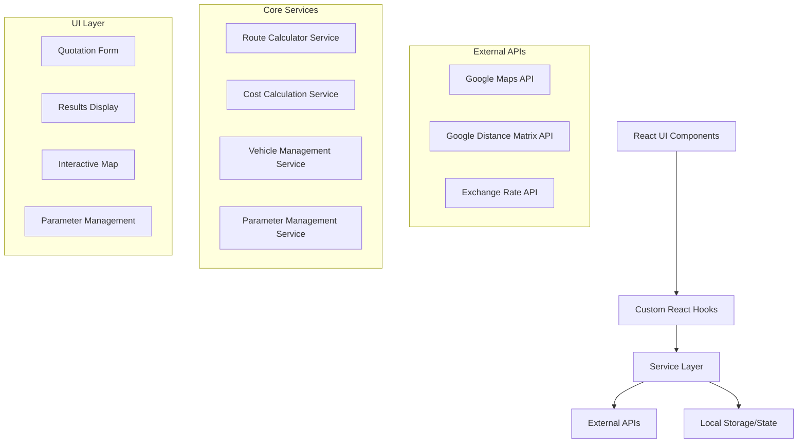

# Project Overview

This is a Next.js web application designed for generating transportation quotations. It's built with a modern tech stack including React, TypeScript, and Tailwind CSS. The application calculates travel costs based on various parameters, vehicle types, and routes.

## Features

*   **Quotation Form:** A comprehensive form to input trip details, including origin, destination, base location, and group size.
*   **Route Calculation:** Integrates with Google Maps and Distance Matrix APIs to calculate accurate routes, distances, and travel times.
*   **Cost Calculation Engine:** A sophisticated engine that calculates detailed costs for fuel, driver expenses (meals and lodging), and vehicle operational costs.
*   **Pricing Module:** A flexible pricing module that allows for configurable markup percentages to generate sale prices in both USD and a local currency (HNL).
*   **Vehicle Management:** A system for managing a fleet of vehicles with different capacities and specifications.
*   **Parameter Management:** A system for managing configurable parameters like fuel prices, meal costs, and exchange rates.
*   **Interactive Map:** An interactive map that displays the calculated route, including origin, destination, and base location markers.

## Key Technologies

*   **Framework:** Next.js
*   **Language:** TypeScript
*   **Styling:** Tailwind CSS & daisyUI
*   **State Management:** React Context API
*   **Form Handling:** React Hook Form
*   **Schema Validation:** Zod
*   **Maps Integration:** Google Maps JavaScript API

## Architecture

The application follows a modular architecture with a clear separation of concerns. It utilizes a service layer for business logic and external API integrations, custom hooks for state management, and React components for the UI.

### High-Level Architecture



# Building and Running

To get the application up and running, follow these steps:

1.  **Install Dependencies:**
    ```bash
    npm install
    ```

2.  **Run the Development Server:**
    ```bash
    npm run dev
    ```
    This will start the application in development mode at `http://localhost:3000`.

3.  **Build for Production:**
    ```bash
    npm run build
    ```
    This will create an optimized production build of the application.

4.  **Start the Production Server:**
    ```bash
    npm run start
    ```
    This will start the application in production mode.

5.  **Linting and Type-Checking:**
    ```bash
    npm run lint
    npm run type-check
    ```
    These commands will check the code for any linting errors and type errors.

# Development Conventions

*   **Styling:** The project uses Tailwind CSS for styling. It also uses daisyUI, a Tailwind CSS component library, for some of the UI components.
*   **State Management:** The global application state is managed using React's Context API. The `AppContext` provides the state and dispatch function to all components wrapped in the `AppProvider`.
*   **Data Fetching:** The application fetches data from a remote API with a fallback to local JSON files. The data loading logic is located in the `src/lib/dataLoader.ts` file.
*   **Code Structure:** The code is organized by feature. Each feature has its own directory in the `src/components` directory. The services are located in the `src/services` directory.